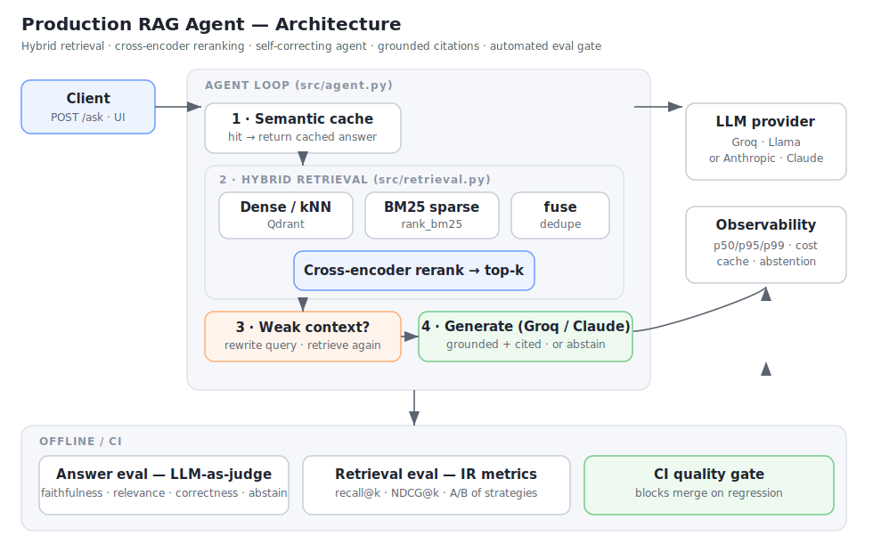
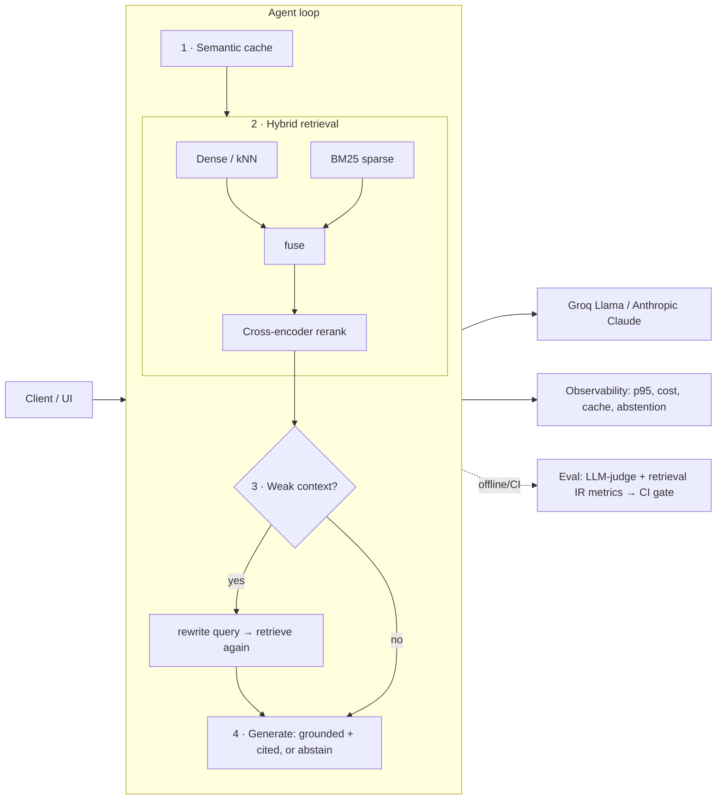

# Building a Production RAG Agent: Retrieval, Evaluation, and the Tradeoffs Nobody Mentions

Most "RAG tutorials" stop at `embed → vector search → prompt → done`. That gets you a demo that
works on the three questions you tried and silently hallucinates on the fourth. This post is about
the parts that actually make a retrieval system trustworthy in production: **retrieval that finds
the right context, an agent that refuses to guess, and an evaluation harness that proves both with
numbers** — plus the messy tradeoffs I hit building it.

The system answers questions over a corpus of **319 Wikipedia ML/AI articles
(6,254 chunks)**. Code: [`rag-agent`](.). Live demo: _<your deployed URL>_.

---

## Architecture





Five design decisions carry the system. Each is defended with a measurement below, not a vibe.

---

## 1. Retrieval: why hybrid + reranking (with numbers)

Pure vector search is the default everyone reaches for, and it has two blind spots:

- **Exact tokens** — error codes, IDs, rare technical terms. Embeddings smear these together.
- **Precision** — bi-encoder cosine similarity is coarse; the top-10 is full of near-misses.

So the pipeline does three things: dense (semantic) **and** BM25 (lexical) candidate generation,
fused, then a **cross-encoder reranker** that scores each `(query, passage)` pair jointly for
precision.

To prove this is worth the complexity, `eval/retrieval_eval.py` runs an A/B/C/D benchmark over
**212 labelled queries** at full corpus scale. Document-level relevance, `recall@k` and
`NDCG@k`:

| strategy | recall@1 | recall@3 | recall@5 | recall@10 | NDCG@5 | NDCG@10 | ms/query |
|---|---|---|---|---|---|---|---|
| BM25 (sparse only) | 0.901 | 0.953 | 0.991 | 0.995 | 0.948 | 0.950 | **8** |
| dense (vector only) | 0.962 | 1.000 | 1.000 | 1.000 | 0.983 | 0.983 | 24 |
| hybrid (dense + BM25) | 0.962 | 1.000 | 1.000 | 1.000 | 0.983 | 0.983 | 31 |
| **hybrid + rerank** (production) | **0.972** | 0.995 | 1.000 | 1.000 | **0.988** | **0.988** | 95 |

Read the table honestly — it's more interesting than a monotonic "everything-helps" story:

- **BM25 alone is the weakest** (recall@1 0.901): keyword matching misses semantic paraphrases.
- **Dense already does well** on these definitional queries (0.962) — embeddings are good at "what is X".
- **Hybrid preserves dense's recall** while adding BM25's exact-match safety net for keyword queries.
- **Reranking gives the best recall@1 (0.972) and NDCG (0.988)** — it puts the *right* document
  *first* most often. That's the metric that matters when you only feed the top passages to the LLM.
- The cost is **latency**: reranking is ~3× slower (95 vs 31 ms/query) because the cross-encoder
  scores every candidate. Worth it for top-1 precision; a knob you'd tune per latency budget.

The lift from reranking looks small here *because the query set is semantically easy* (definitional
"what is X" questions where dense already wins). On keyword-heavy, ambiguous, or entity queries the
gap widens — which is the case for the exact-token failures dense retrieval is known to miss.

---

## 2. The agent loop: self-correction and abstention

The "agent" is deliberately small and legible — no opaque framework:

1. Retrieve hybrid context.
2. **If the reranker's top score is below a threshold, the context is "weak"** → rewrite the query
   into a keyword-rich form and retrieve again (one self-correction pass).
3. Generate an answer **constrained to the retrieved context**, with inline `[source]` citations.
4. **If the context still doesn't contain the answer, abstain** — literally return *"I don't have
   enough information in the provided documents to answer that."* — instead of hallucinating.

Abstention is a feature, not a failure mode. It's the single biggest lever on trustworthiness, and
it's measured explicitly (below).

---

## 3. Evaluation: quality as a number with a threshold

There are **two** evals, because answer quality and retrieval quality are different things:

**Answer eval (`eval/evaluate.py`)** — an **LLM-as-judge** harness. For every question in a curated
golden set (including deliberate "should-abstain" traps), it scores the live answer on:

- `faithfulness` — is every claim grounded in the retrieved context?
- `answer_relevance` — does the answer address the question?
- `answer_correctness` — does it match the reference answer?
- `abstention_correct` — did it abstain *exactly* when it should?

**Retrieval eval (`eval/retrieval_eval.py`)** — the IR metrics above (`recall@k`, `NDCG@k`), no LLM.

Both write JSON reports; the answer eval **exits non-zero when a metric drops below threshold**, so
it runs as a **GitHub Actions gate that blocks merges that regress quality**. Add a failing example
to the golden set → it's covered forever. Latest answer-eval scores:

Backend **Groq `llama-3.1-8b-instant`**, 319-doc corpus, 31 questions (3 abstention traps):

| metric | score | gate |
|---|---|---|
| faithfulness | **0.904** | ≥ 0.85 ✅ |
| answer_relevance | **0.913** | ≥ 0.85 ✅ |
| answer_correctness | **0.855** | ≥ 0.80 ✅ |
| abstention_correct | **1.000** | ≥ 0.90 ✅ |

All gates pass — and notice these run a bit lower than the same eval on **Llama-3.3-70B** (which
scored ~1.0 / 0.96 / 0.93 / 1.0 on a smaller corpus). That's the model-capability tradeoff in
action: I dropped to the 8B model after exhausting the 70B daily token budget (see below), and you
can see the cost in correctness. Same harness, one env var, honest numbers.

---

## 4. The tradeoffs nobody mentions

This is the part that doesn't show up in tutorials.

### a) Your LLM judge is only as good as the model behind it
I ran the eval with **Llama-3.1-8B** as judge and again with **Llama-3.3-70B**. The 8B judge was
materially **noisier** — it scored several obviously-correct answers `0.0` on relevance, pure judge
error, not model error. Lesson: **the grader should be at least as capable as the student.** Use
your strongest model for judging, keep temperature at 0, and make the judge prompt return a single
number so parsing can't add noise. I also special-cased abstention (an abstention is faithful and
relevant by definition) — that's a *correct* metric fix, not gaming the gate.

### b) Token cost is dominated by the input, not the output
A RAG call's input is `system prompt + retrieved passages + question` — often **~900 tokens** — while
the output (especially an abstention) can be **~15 tokens**. Even when the model abstains, it still
*read* all the retrieved context to decide it couldn't answer. So cost optimization lives on the
**input** side: retrieve fewer/smaller passages (`RERANK_TOP_K`), tighter chunks, and a **semantic
cache** that skips the LLM entirely on repeat questions (→ 0 input tokens).

### c) Free-tier rate limits are per-model-per-day, per-organization
Groq's free tier caps **tokens-per-day per model**. A couple of full eval runs (each ~70 LLM calls)
exhausted the 70B model's daily budget — and rotating the API key didn't help, because the limit is
**per-org, not per-key**. The fix was switching the answer model to a different model
(`llama-3.1-8b-instant`) with its own separate daily bucket. Provider-agnostic config (one env var
to swap Groq↔Claude or change models) turned a dead demo into a 30-second fix.

### d) Embedded vector DBs are single-process
The local on-disk Qdrant holds a **file lock** — exactly one process at a time. The Streamlit app
holding it meant `ingest`/`eval` couldn't open the store until I stopped the app. Fine for a laptop
demo; in production you run the **Qdrant server** (in the repo's `docker-compose.yml`) so readers and
writers coexist.

---

## 5. Scale and latency

The corpus is **319 articles → 6,254 chunks**, fetched by a reproducible pipeline
(`scripts/fetch_wikipedia.py`) from Wikipedia's API. At this scale, average retrieval is **~95
ms/query** for the full hybrid + rerank path (24 ms without reranking); embeddings and the reranker
run locally on CPU. Vectors live in Qdrant; BM25 is built in-memory at startup.

---

## What I'd do next

- A learned/fine-tuned reranker on in-domain query–passage pairs.
- Multi-hop agentic retrieval for questions that need two documents.
- Streaming responses and a feedback loop that adds thumbs-down questions to the golden set.

## Reproduce it

```bash
pip install -r requirements.txt
cp .env.example .env                 # add GROQ_API_KEY (or ANTHROPIC_API_KEY)
python -m scripts.fetch_wikipedia --max-articles 700   # build the corpus
python -m scripts.run_ingest         # chunk + embed + index
python -m eval.retrieval_eval        # the A/B retrieval benchmark
python -m eval.evaluate              # the LLM-judged answer eval + gate
streamlit run streamlit_app.py       # try it
```

*Built with Python, Groq/Llama (swappable to Claude), sentence-transformers, Qdrant, rank-bm25,
FastAPI, Streamlit, Docker, and GitHub Actions.*
